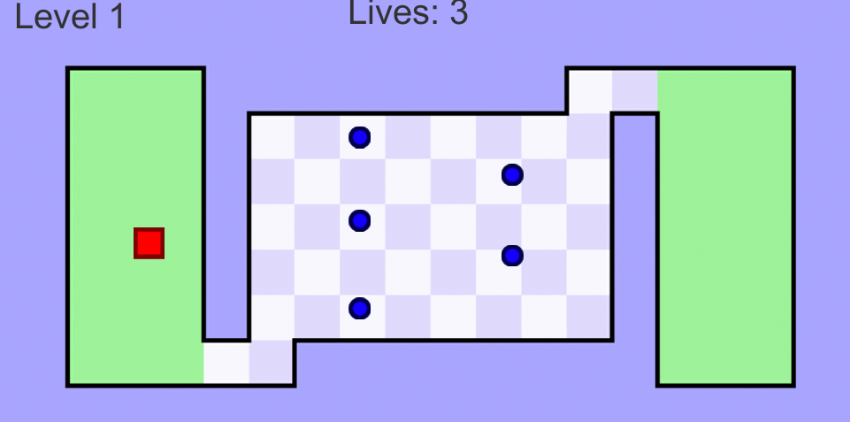
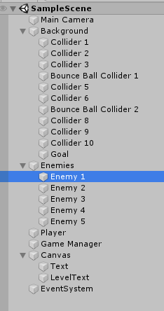

# World's Hardest Game

## Overview
This is an impossible game remake made with Unity 2019. The objective is to navigate your player through a series of challenging levels without touching the obstacles.

## Project Details
**Author**: Dominick Ferro  
**Date**: 11/06/2023  
**Language**: C#  
**Engine**: Unity 2019  

## Description
This project is a Unity-based game where the player must move through levels filled with obstacles. It is a remake of the classic "World's Hardest Game".

## Screenshots
Here are some screenshots of the project:

 <br>


## Installation
1. **Clone the repository**:
   ```sh
   git clone https://github.com/Dominick1998/Worlds-Hardest-Game.git
   ```
2. **Open the Project in Unity**:
   - Launch Unity Hub.
   - Click on `Open`.
   - Navigate to the cloned repository directory and select it.
   - Open the project.

## How to Play
- Use the arrow keys to move the player.
- Navigate through the levels without touching any obstacles to reach the goal.

## License
This project is licensed under the MIT License. See the `LICENSE` file for details.
